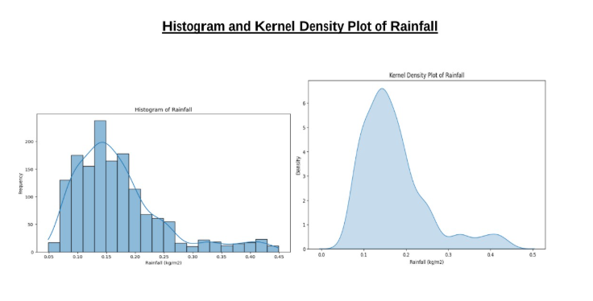
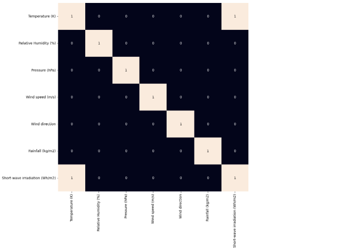
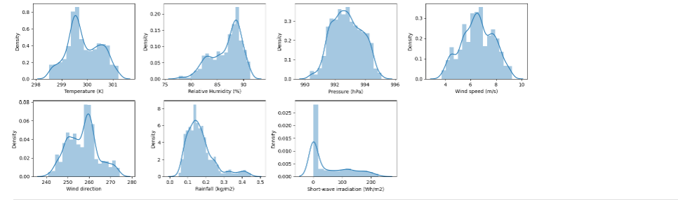
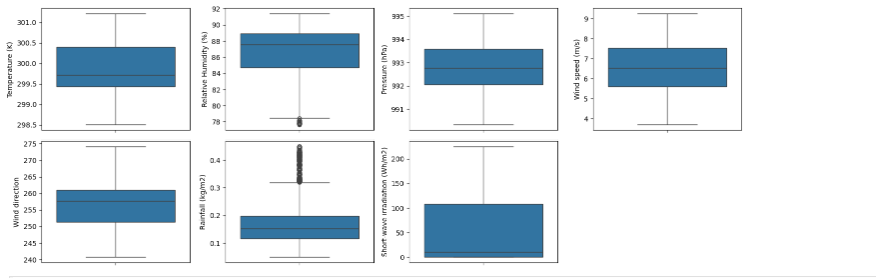
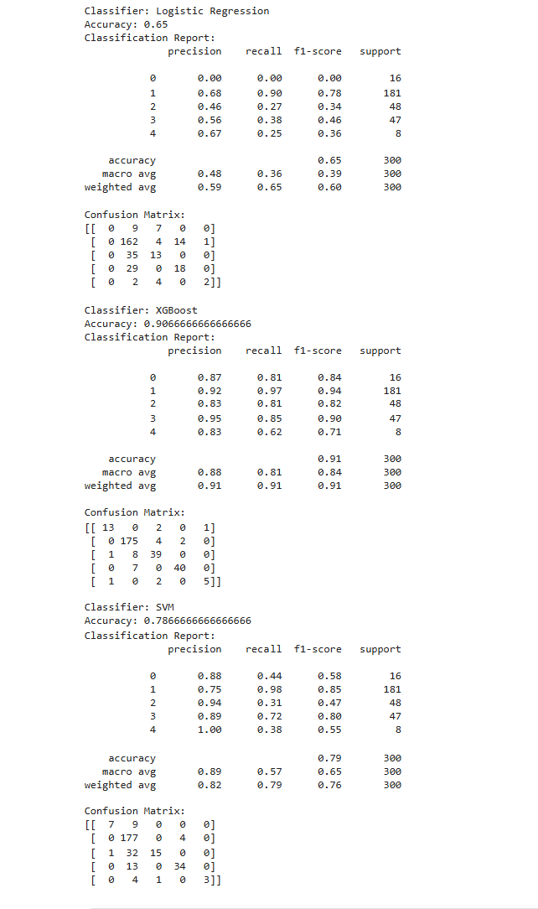

# 🌧️ Rainfall Prediction Analysis using Machine Learning

## 📌 Overview
This project focuses on predicting rainfall intensity using machine learning techniques.  
Weather-related data is analyzed, cleaned, and processed to build classification models that predict rainfall categories based on environmental and atmospheric variables.

The goal of the project is to understand rainfall patterns and evaluate the performance of different machine learning algorithms in predicting rainfall intensity.

---

## 🎯 Problem Statement
Rainfall prediction is important for agriculture, disaster management, water resource planning, and weather forecasting. By analyzing historical weather data, machine learning models can identify patterns that influence rainfall occurrence.

This project applies multiple machine learning algorithms to classify rainfall into different categories based on weather parameters.

---

## 📊 Dataset
The dataset contains weather-related features that influence rainfall. These features may include atmospheric and environmental parameters such as temperature, humidity, pressure, wind conditions, and other meteorological variables.

Data preprocessing steps are applied to clean and prepare the dataset for model training.

---

## 🌦️ Rainfall Categories
The rainfall values are transformed into categorical labels to convert the prediction task into a classification problem.

The categories used are:

- No Rain
- Light Rain
- Moderate Rain
- Heavy Rain
- Very Heavy Rain

---

## 🛠️ Technologies Used

- Python  
- NumPy  
- Pandas  
- Matplotlib  
- Seaborn  
- Scikit-learn  
- XGBoost  

---

## 🔄 Project Workflow

### 1. Data Loading
The dataset is loaded using the **Pandas** library for data analysis.
### Dataset

Dataset used in this project: Historical Weather Data of Goa, India.

Source:
https://www.kaggle.com/datasets/nitinsss/goa-india-weather-data

The dataset contains meteorological observations recorded every 15 minutes including temperature, humidity, pressure, wind speed, wind direction, rainfall, and solar radiation.

### 2. Data Exploration
Initial exploration is performed to understand the dataset structure:
- Viewing dataset shape
- Checking data types
- Identifying missing values
- Statistical summary of features

### 3. Data Preprocessing
Several preprocessing steps are applied:
- Cleaning column names
- Handling missing values using mean imputation
- Encoding categorical values (Yes/No → 1/0)
- Removing highly correlated features
- Feature scaling using `StandardScaler`

### 📊 Exploratory Data Analysis

Exploratory Data Analysis (EDA) helps understand rainfall patterns and feature relationships.

### Rainfall Distribution


### Correlation Heatmap


### Feature Distribution


### Boxplot for Outliers



---

### 5. Feature Engineering
Key feature engineering steps include:
- Removing redundant or highly correlated features
- Converting rainfall values into categorical labels
- Selecting meaningful predictors for model training

### 6. Model Training
Multiple machine learning models are trained to classify rainfall:

- Logistic Regression
- Support Vector Machine (SVM)
- XGBoost Classifier

Pipelines are used to combine preprocessing and model training.

## 📈 Model Performance

The models were evaluated using classification metrics.

| Model | Accuracy | Precision | Recall | F1 Score |
|------|------|------|------|------|
| Logistic Regression | 0.65 | 0.59 | 0.65 | 0.60 |
| SVM | 0.79 | 0.82 | 0.79 | 0.76 |
| XGBoost | 0.91 | 0.91 | 0.91 | 0.91 |

---

### Classification Report



### Model Comparison

Among the three models, XGBoost achieved the best performance with an accuracy of 91%, outperforming Logistic Regression and SVM. This indicates that tree-based ensemble models are more effective for capturing complex relationships in the weather dataset.


## 🔍 Key Insights

- Rainfall distribution shows most observations fall within the light to moderate rainfall category.
- Certain weather variables show stronger correlation with rainfall levels.
- Tree-based models like XGBoost generally perform better than linear models for this dataset.

---

## 📁 Project Structure
    Rainfall_Prediction_Analysis
    │
    ├── dataset
    │ └── goa_weather_data.csv
    │
    ├── Rainfall_Prediction.ipynb
    │
    └── README.md

---

---

## ▶️ How to Run the Project

### 1️⃣ Clone the repository
```bash
git clone https://github.com/Charulpareek/Rainfall_Prediction_Analysis.git
```

### 2️⃣ Navigate to the project directory
```bash
cd Rainfall_Prediction_Analysis
```

### 3️⃣ Install required libraries

pip install pandas numpy matplotlib seaborn scikit-learn xgboost

### 4️⃣ Run the notebook

Open the notebook file:
```bash
'Rainfall_Prediction.ipynb'
```
Run the cells to reproduce the analysis and model training.

---
## 🚀 Future Improvements

Possible improvements for this project include:

- Hyperparameter tuning
- Feature importance analysis
- Using larger weather datasets
- Model deployment as a web application
- Real-time rainfall prediction system
- Integration with weather APIs

---

## 🌍 Applications

Rainfall prediction models can be useful in several real-world applications:

- Agriculture planning
- Flood prediction and disaster management
- Weather forecasting
- Smart irrigation systems

---

## 👨‍💻 Author

## Author

Developed as part of a machine learning project focused on weather data analysis and rainfall prediction using classification models.
